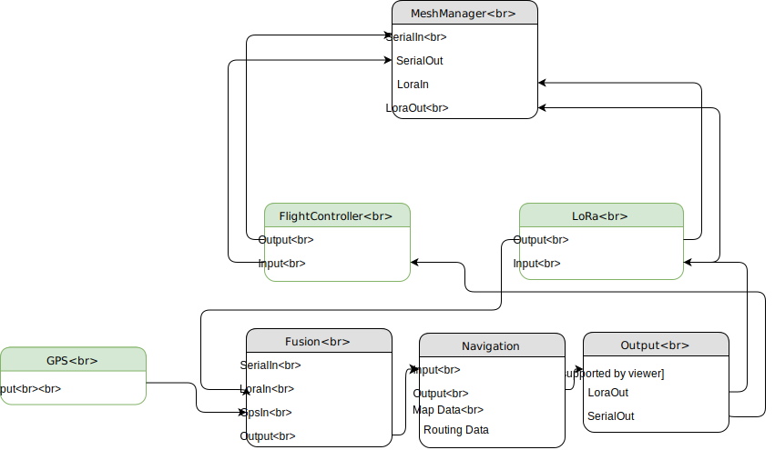

# FlightComputer
All the modules running on the Raspberry Pi. 

## Structure

## Transmitter-IDs
| Device | Id |
| --- | --- |
| Receiver-Wing | 13 |
| LoRa-Remote | 17 |
| Flight-Controller | 23 |
| Flight-Computer | 38 |
| FrSky-Remote | 56 |
| Ground-Station | 63 |
